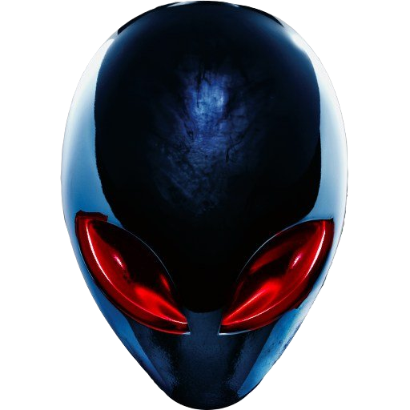

Steven.News

## About Steven.NEWS
Steven.news is on a Laravel Framework and work in progress.

Details for localHost installs are outlined here.

Needed Requirements installed 
- Composer : [Install Here](https://getcomposer.org/download/)
- Node Package Manager 'NPM' : [Install Here](https://docs.npmjs.com/downloading-and-installing-node-js-and-npm)
- PHP 8.1
- MySql 8.0.27 or higher

For PHP and MySql I use WAMP but you are free to use what ever you like as long as you have php version 8.1 included 
and MySql or MariaDB 

